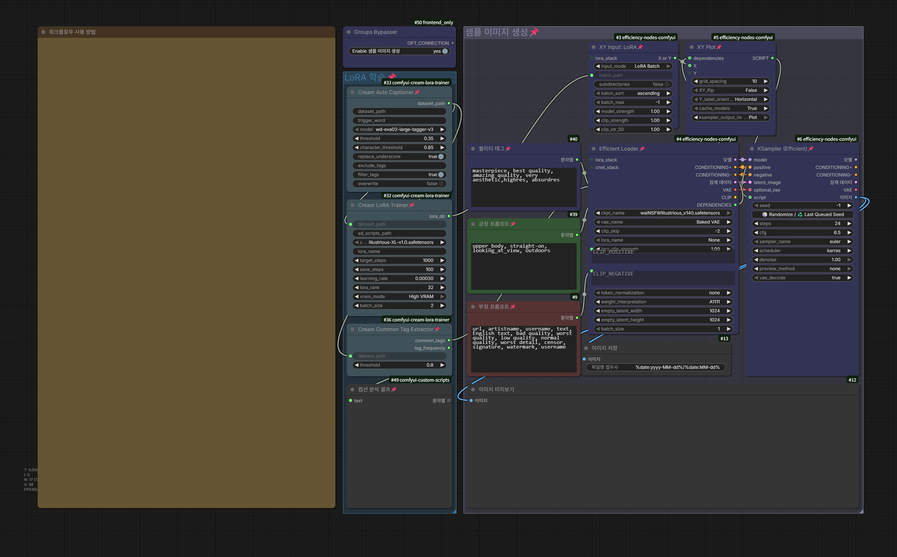
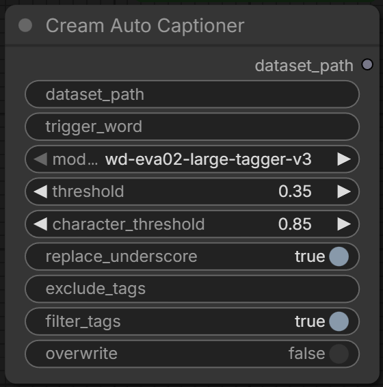
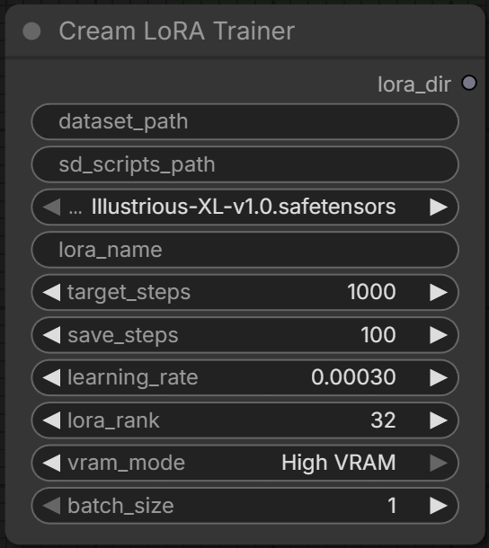
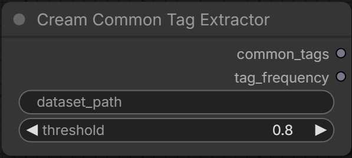

# Cream LoRA Trainer

[](LICENSE)

소규모 데이터셋(20장 이하)으로 Illustrious XL 기반 캐릭터 LoRA를 간편하게 학습하기 위한 ComfyUI용 커스텀 노드입니다.



## 특징

- **올인원 워크플로우** — 캡션 생성 → 학습 → 샘플 비교까지 한 워크플로우에서 완료
- **자동 캡션 + 필터링** — WD tagger로 이미지를 자동 태깅하고, 캐릭터 외형 태그(눈/머리 색상, 체형, 종족 등)를 자동 제거
- **공통 태그 추출** — 캡션 파일들을 분석하여 공통 태그를 추출, 샘플 이미지 생성에 활용
- **sd-scripts 자동 설치** — 경로를 비워두면 sd-scripts를 자동으로 다운로드·설치
- **학습 캐싱** — 동일한 설정+데이터셋이면 이전에 생성된 LoRA를 재사용

## 설치

**방법 1: Git Clone**

```bash
cd ComfyUI/custom_nodes
git clone https://github.com/vanila-cream/cream_lora_trainer
```

**방법 2: 수동 다운로드**

1. 상단의 `Code` → `Download ZIP`을 클릭하여 다운로드합니다.
2. 압축을 해제한 뒤, 폴더를 ComfyUI의 `custom_nodes` 폴더에 넣습니다.
3. 폴더 이름이 `comfyui-cream-lora-trainer`인지 확인합니다. (`-main` 등의 접미사가 붙어있다면 제거해주세요.)

ComfyUI를 재시작하면 의존성이 자동으로 설치되고 사용할 수 있습니다.

## 사용 방법

1. 워크플로우 파일(`workflows/aio cream workflow.json`)을 ComfyUI에 불러옵니다.
2. 각 노드에 데이터셋 경로, 체크포인트 등을 설정합니다.
3. 워크플로우를 실행하면 캡션 생성 → 학습 → 샘플 생성이 자동으로 진행됩니다.

## 노드 설명

### Cream Auto Captioner

WD tagger 모델로 데이터셋 이미지를 자동 태깅하고 캡션 파일(`.txt`)을 생성합니다.



| 기능 | 설명 |
|------|------|
| 모델 선택 | WD-EVA02-Large v3 등 9종의 tagger 모델 지원 (자동 다운로드) |
| 태그 필터링 | 캐릭터 외형 태그를 정규식 기반 3층 구조로 자동 제거 |
| 트리거 워드 | 모든 캡션 앞에 사용자 지정 트리거 워드 자동 삽입 |
| 덮어쓰기 제어 | 이미 캡션이 있는 이미지는 건너뛸 수 있음 |

<details>
<summary>설정값</summary>

| 설정 | 기본값 | 설명 |
|------|--------|------|
| `dataset_path` | — | 태깅할 이미지가 있는 폴더 경로. 생성될 캡션(`.txt`) 파일이 이곳에 저장됩니다. |
| `trigger_word` | — | 모든 캡션 앞에 추가할 트리거 워드. 비워두면 생략됩니다. |
| `model` | wd-eva02-large-tagger-v3 | 사용할 WD Tagger 모델. |
| `threshold` | 0.35 | 일반 태그 포함 최소 확률. 낮을수록 태그가 많아집니다. |
| `character_threshold` | 0.85 | 캐릭터 이름 태그(예: `hatsune_miku`) 포함 최소 확률. 높을수록 확실한 것만 포함됩니다. |
| `replace_underscore` | true | 태그의 밑줄을 공백으로 변환 (예: `long_hair` → `long hair`). |
| `exclude_tags` | — | 캡션에서 제외할 태그 (쉼표 구분). |
| `filter_tags` | true | 캐릭터 외형 태그(눈/머리 색상, 체형, 종족 등) 자동 제거. |
| `overwrite` | false | `true`면 기존 캡션 파일을 덮어씁니다. |

</details>

<details>
<summary>태그 필터링 상세</summary>

캐릭터 LoRA가 외형을 이미지 자체에서 학습하도록, 캡션에서 고정 외형 태그를 제거합니다.
변동 속성(표정, 포즈, 구도, 배경 등)은 유지됩니다.

**제거 대상 (정규식 패턴 기반)**

| 카테고리 | 예시 |
|----------|------|
| 눈 색상/형태 | `blue eyes`, `heterochromia`, `slit pupils` |
| 머리 색상/스타일 | `blonde hair`, `long hair`, `ponytail`, `ahoge`, `hair ornament` |
| 피부 | `dark skin`, `pale skin`, `tanned` |
| 체형 | `large breasts`, `muscular`, `petite`, `thick thighs` |
| 특징 | `cat ears`, `dragon tail`, `angel wings`, `horns` |
| 종족 | `elf`, `vampire`, `demon`, `kitsune` |
| 수인 | `anthro`, `furry`, `fox girl`, `wolf boy` |

**유지 대상 (항상 보존)**

| 카테고리 | 예시 |
|----------|------|
| 표정 | `smile`, `crying`, `blush`, `angry` |
| 포즈 | `standing`, `sitting`, `arms crossed`, `hand on hip` |
| 구도 | `looking at viewer`, `from above`, `cowboy shot`, `close-up` |
| 배경 | `simple background`, `outdoors`, `night`, `sunset` |
| 인원 | `solo`, `1girl`, `1boy` |

</details>

---

### Cream LoRA Trainer

kohya-ss/sd-scripts를 사용하여 SDXL LoRA를 학습합니다.



| 기능 | 설명 |
|------|------|
| sd-scripts 자동 설치 | 경로를 비워두면 자동으로 다운로드·설치 |
| VRAM 모드 | Low VRAM / High VRAM 프리셋 지원 |
| 중간 저장 | 지정 스탭마다 LoRA를 저장하여 단계별 비교 가능 |
| 학습 캐싱 | 동일 조건이면 기존 결과 재사용 |

<details>
<summary>설정값</summary>

| 설정 | 기본값 | 범위 | 설명 |
|------|--------|------|------|
| `dataset_path` | — | — | 학습할 이미지와 `.txt` 캡션 파일이 있는 폴더 경로. |
| `sd_scripts_path` | — | — | kohya sd-scripts의 경로. 비워두면 자동 설치. |
| `ckpt_name` | — | ComfyUI 체크포인트 목록 | 학습에 사용할 SDXL 베이스 체크포인트. |
| `lora_name` | — | — | 저장될 로라 파일 이름. |
| `target_steps` | 1000 | 10~50000 | 총 학습 스탭 수. 소규모 데이터셋 기준 500~2000 권장. |
| `save_steps` | 100 | 0~10000 | N 스탭마다 중간 로라 저장. 0이면 최종 결과만 저장. |
| `learning_rate` | 0.0003 | 0.00001~0.1 | U-Net 학습률. TE LR은 자동으로 1/10 적용. |
| `lora_rank` | 32 | 4~128 | LoRA 차원 수. 높을수록 표현력↑, 파일 크기↑. 16~64 권장. |
| `vram_mode` | High VRAM | — | Low VRAM (8GB+): U-Net만 학습 / High VRAM (12GB+): U-Net + TE 학습. |
| `batch_size` | 1 | 1~8 | 스탭당 동시 처리 이미지 수. Low VRAM에서는 1로 고정. |

</details>

> **sd-scripts 자동 설치가 실패하는 경우**
>
> [StabilityMatrix](https://lykos.ai/)에서 kohya_ss를 설치한 뒤, `sd_scripts_path`에 `Data/Packages/kohya_ss/sd-scripts` 경로를 입력하면 해당 환경을 그대로 사용할 수 있습니다.

---

### Cream Common Tag Extractor

캡션 파일들을 분석하여 공통 태그와 빈도 분석 결과를 출력합니다.



| 기능 | 설명 |
|------|------|
| 공통 태그 추출 | 지정 비율 이상 등장하는 태그를 쉼표 구분 문자열로 출력 |
| 빈도 분석 | 모든 태그의 출현 빈도를 퍼센트 그룹별로 정리 |

<details>
<summary>설정값</summary>

| 설정 | 기본값 | 범위 | 설명 |
|------|--------|------|------|
| `dataset_path` | — | — | 이미지와 `.txt` 캡션 파일이 있는 폴더 경로. |
| `threshold` | 0.8 | 0.0~1.0 | 공통 태그 판정 기준. 전체 캡션 중 이 비율 이상에 등장하는 태그를 추출. |

</details>

## 주요 설정

### 수정 가능한 설정

| 설정 | 기본값 | 범위 | 설명 |
|------|--------|------|------|
| `target_steps` | 1000 | 10~50000 | 총 학습 스탭 수 (소규모 데이터셋 기준 500~2000 권장) |
| `save_steps` | 100 | 0~10000 | N 스탭마다 중간 로라 저장 (0=최종 결과만 저장) |
| `learning_rate` | 0.0003 | 0.00001~0.1 | U-Net 학습률 (TE LR은 자동으로 1/10 적용) |
| `lora_rank` | 32 | 4~128 | LoRA 차원 수. 높을수록 표현력↑, 파일 크기↑ (16~64 권장) |
| `vram_mode` | High VRAM | — | Low VRAM (8GB+): U-Net만 학습 / High VRAM (12GB+): U-Net + TE 학습 |
| `batch_size` | 1 | 1~8 | 스탭당 동시 처리 이미지 수 (Low VRAM에서는 1로 고정) |

<details>
<summary>고정 설정값 (노드에서 수정 불가)</summary>

| 설정 | 값 | 설명 |
|------|-----|------|
| `resolution` | 1024×1024 | 학습 해상도 |
| `optimizer_type` | Adafactor | 메모리 효율적인 옵티마이저 |
| `lr_scheduler` | constant_with_warmup | 워밍업 후 일정한 학습률 |
| `lr_warmup_steps` | target_steps × 10% (최대 100) | 워밍업 스텝 수 (동적 계산) |
| `mixed_precision` | bf16 | 학습 정밀도 |
| `fp8_base` | true | 베이스 모델 fp8 (VRAM 절약) |
| `noise_offset` | 0.0357 | 어두운/밝은 이미지 품질 개선 |
| `min_snr_gamma` | 5 | 학습 안정성 개선 |
| `no_half_vae` | true | VAE NaN 에러 방지 |

</details>

전체 설정값 문서: [SETTINGS.md](SETTINGS.md)

## 크레딧

이 프로젝트는 아래 프로젝트들을 기반으로 합니다:

- **[kohya-ss/sd-scripts](https://github.com/kohya-ss/sd-scripts)** — LoRA 학습 백엔드
- **[pythongosssss/ComfyUI-WD14-Tagger](https://github.com/pythongosssss/ComfyUI-WD14-Tagger)** — Auto Captioner 노드의 원본 참고
- **[ShootTheSound/comfyUI-Realtime-Lora](https://github.com/ShootTheSound/comfyUI-Realtime-Lora)** — LoRA Trainer 노드의 구조 참고
- **[cubiq/comfyui-instant-reference](https://github.com/cubiq/comfyui-instant-reference)** — sd-scripts 자동 설치 패턴 참고

## 라이선스

[MIT](LICENSE)
